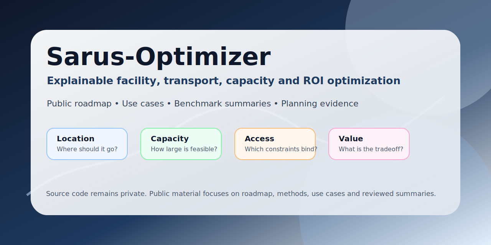
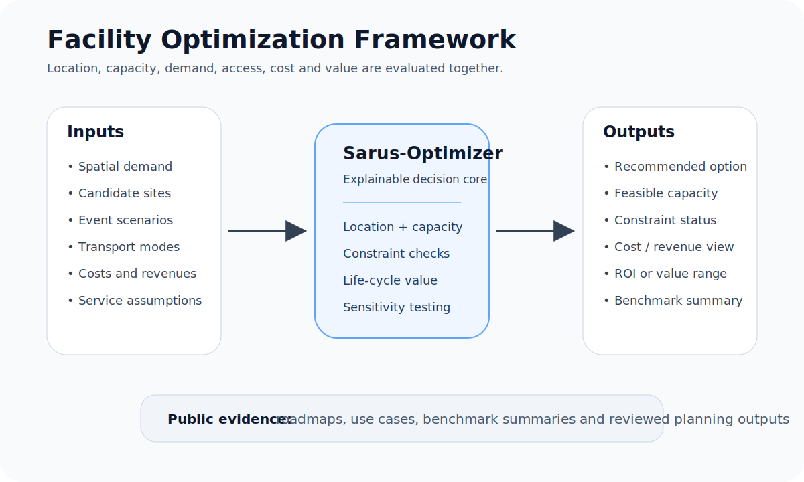
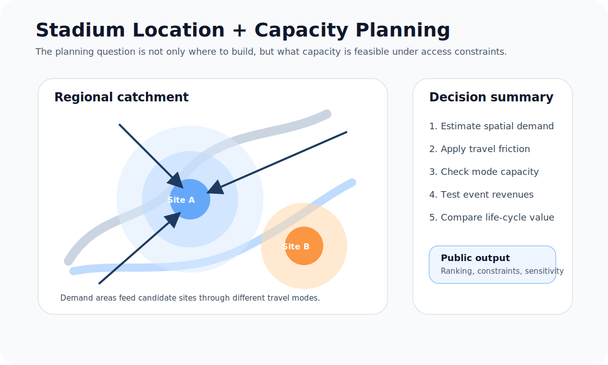
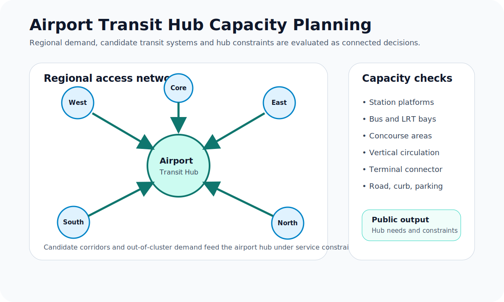

# Sarus-Optimizer

**Sarus-Optimizer** is a private planning-optimization system being developed by Sarus Tesis Planlama. This public repository shares the project vision, roadmap, use cases, public case narratives, and benchmark-summary approach without publishing source code.

The project focuses on explainable planning decisions where **location, capacity, demand, transport access, cost, service quality, and long-term value** interact.

## What Sarus-Optimizer is for

Many facility and infrastructure decisions fail when location, capacity, demand, and access are evaluated separately. Sarus-Optimizer is being designed to connect these questions in one planning framework:

- Where should a facility be located?
- How large should it be?
- Which demand groups can realistically reach it?
- Which transport or access constraints become binding?
- How do revenue, cost, service level, and life-cycle value change under different assumptions?
- Which candidate performs best, and why?

## Current public focus areas

| Focus area | Public page | Status |
|---|---|---|
| Project vision | [Vision](VISION.md) | Published |
| Roadmap | [Roadmap](ROADMAP.md) | Published |
| Milestones | [Milestones](MILESTONES.md) | Published |
| Use cases | [Use Cases](USE_CASES.md) | Published |
| Benchmark structure | [Benchmark Summaries](BENCHMARK_SUMMARIES.md) | Published |
| Toronto stadium planning case | [Toronto Stadium Case](TORONTO_STADIUM_CASE.md) | Public narrative published |
| Airport-transit hub planning case | [Airport Transit Case](AIRPORT_TRANSIT_CASE.md) | Public narrative published |
| FAQ | [FAQ](FAQ.md) | Published |
| Public changes | [Changelog](CHANGELOG.md) | Published |
| Rights notice | [Rights](RIGHTS.md) | Published |

## Public case narratives

### Toronto stadium planning

The Toronto stadium case frames stadium planning as a connected location-capacity-access-value problem. It is designed to compare candidate locations and capacity alternatives under spatial demand, transport, event, cost, revenue, and sensitivity assumptions.

[Read the Toronto stadium planning case](TORONTO_STADIUM_CASE.md)

### Airport-transit hub planning

The airport-transit case frames airport ground access as a regional demand, candidate-transit, and hub-capacity problem. It is designed to compare regional transit alternatives, hub service needs, station capacity, road/curb/parking limits, and service-level constraints.

[Read the airport-transit hub planning case](AIRPORT_TRANSIT_CASE.md)

## What is public here

This repository may include:

- vision and positioning
- public roadmap
- milestone summaries
- use cases
- public case narratives
- benchmark-summary formats
- selected diagrams and visuals
- FAQ and public status notes

## What remains private

This public repository does not disclose:

- source code
- private algorithms or implementation details
- internal task lists
- unresolved bug lists
- proprietary data
- exact private calibration assumptions
- unreviewed numerical claims

## Benchmark status

No final numerical benchmark claims are currently published here.

Benchmark summaries should be published only after assumptions, outputs, and limitations have been reviewed. Public summaries will focus on planning evidence: candidate comparisons, constraint summaries, sensitivity results, and reviewed outputs.

## Follow the project

Star or watch this repository to follow public updates. Future public updates may include reviewed benchmark summaries, additional diagrams, public case-study refinements, and selected static outputs.

## Rights

Copyright © Sarus Tesis Planlama. All rights reserved.

No open-source software license is granted by this repository. See [RIGHTS.md](RIGHTS.md).
